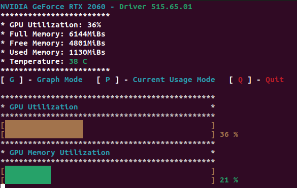
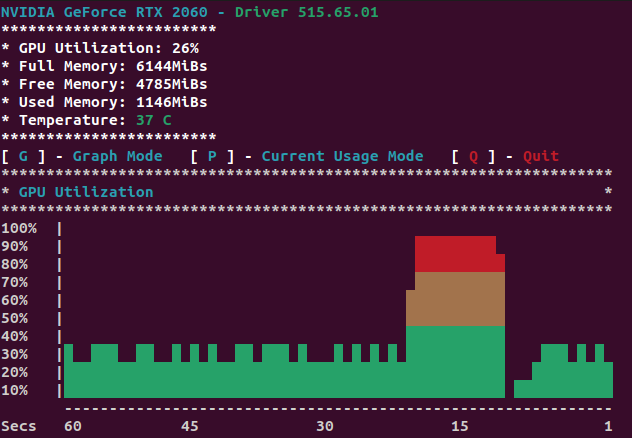

# nvidia-gpu-graph-cli
A simple and lightweight CLI graphing tool for NVIDIA video cards

## Current Usage Mode

## Graph Mode


## Make
**nvidia-smi** tool installation is required. If not found in path, it will error out at runtime.

### Build
Builds binary file.
```bash
make
```

### Clean
Removes built binary.
```bash
make clean
```

### Install
Installs to ~/home/tools/ directory.
```bash
make install
```
